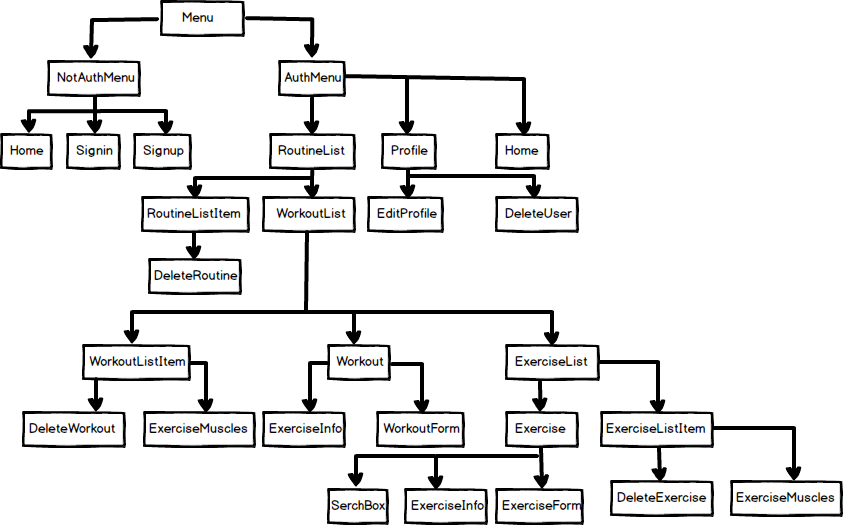

# WorkoutBuilder
Personal project using MERN stack. 
The idea is to build a routine, add its workouts(daily exercises) and add its exercises, then you will go through it and add your weights and repetitions so it will tell you the last exercise information.

You can find this app deployed here https://workout-builder-app.herokuapp.com

In order to run the project, do the following steps:
- clone or download the project.
- If not installed, install Node.js.
- Install Mongodb.
- In the console, navigate to the project folder.
- Execute "npm install" to install all project dependencies.
- Execute "npm run development" to run the app.

### Technologies:
- Material UI.
- User CRUD and auth in a MERN application
- Handling HTTP requests with an Express server
- Using a Mongoose schema for a user model
- APIs for user CRUD and auth
- Auth with JWT for protected routes
- Running backend code and checking APIs
- Using Service Workers with workbox to avoid re calling the exercise API and using it from cache.
- Using Redux to manage the state of the app.
-Testing with Jest and Enzyme.

### Project Diagram

